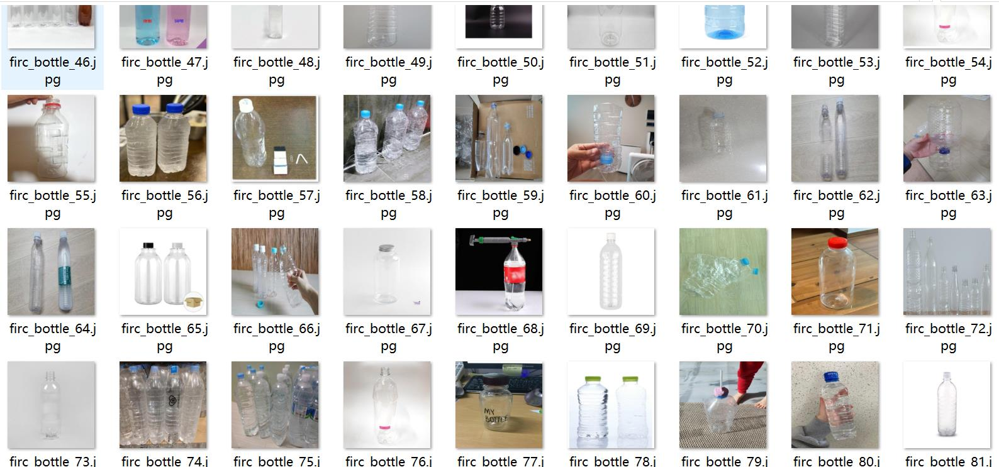
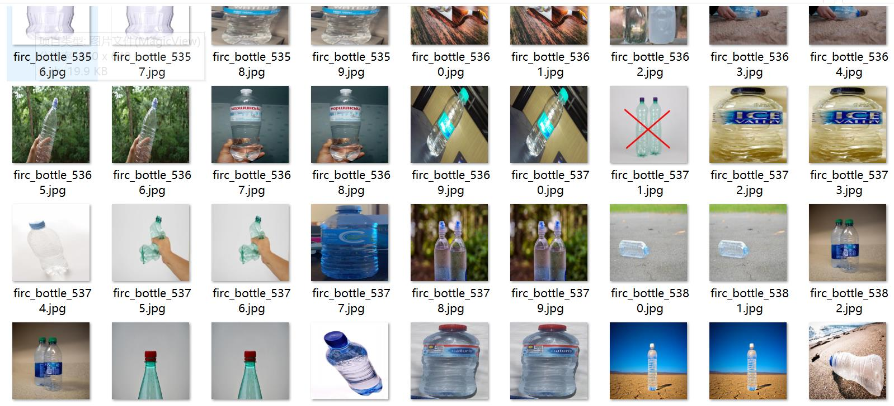
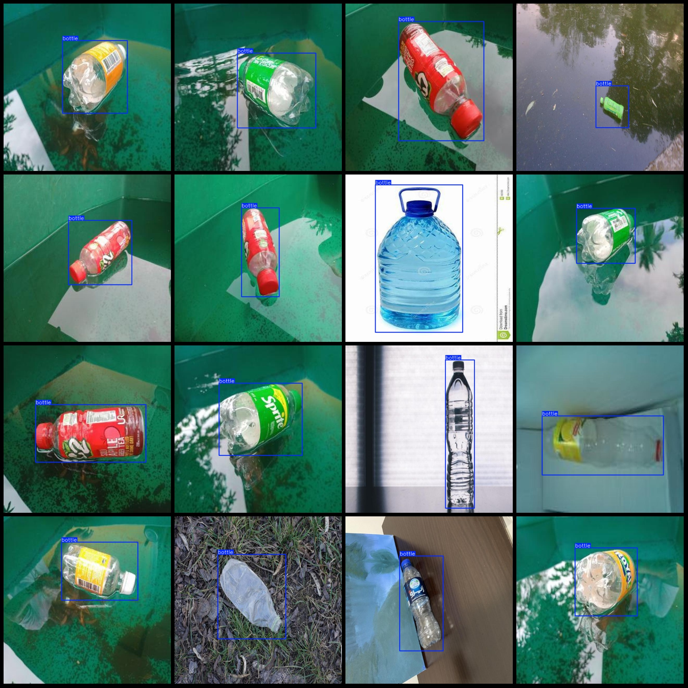
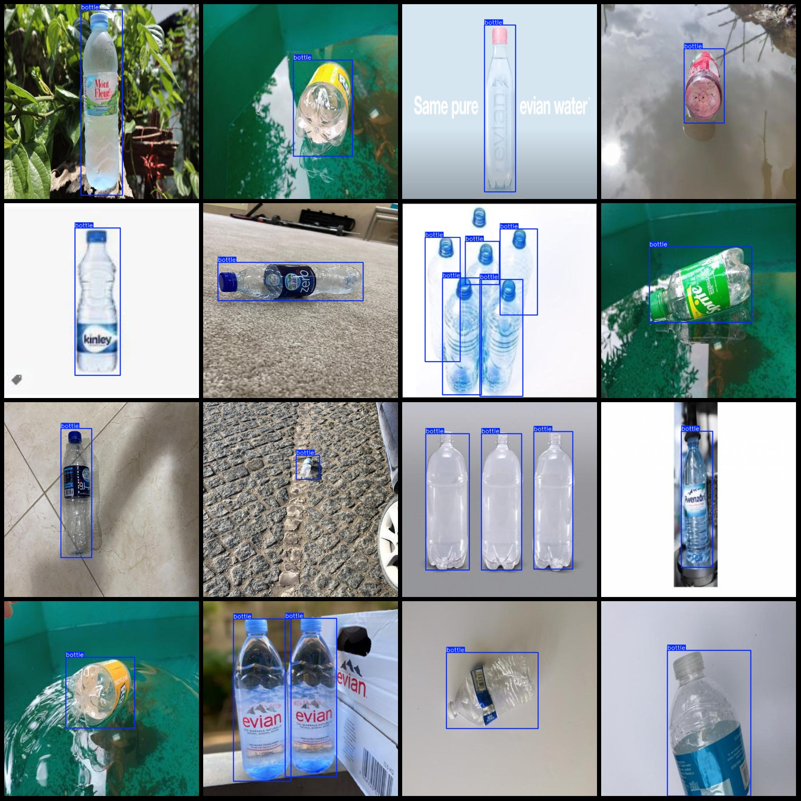

# Plastic Bottle Detection Dataset VOC+YOLO Format, 5846 Images, 1 Classification

Dataset format: Pascal VOC format + YOLO format (txt file without split path, only containing jpg images and corresponding VOC format xml files and YOLO format txt files)

Number of images (jpg file count): 5846
Number of annotations (xml file count): 5846
Number of annotations (txt file count): 5846
Number of annotation categories: 1
Annotation category name: ["bottle"]
Number of bounding boxes for each category:
- Bottle bounding box count = 7605
Total bounding boxes = 7605
Number of images per category:
- Bottle images = 5846
Image resolution: 640x640
Annotation tool used: labelImg
Annotation rule: draw a rectangle around the category
Special notice: The dataset does not have separate training, validation, or test sets. Users must split them themselves.
Special notice: This dataset does not guarantee the accuracy of models or weight files trained on it.
Image preview:
Annotation example:
## Images

Here is a pay link on Stripe ( https://buy.stripe.com/3cs8yP7sY87d0vu9AB ). Please contact me lonlonago@foxmail.com after funding $89, and I will send you a complete data files , thank you!

